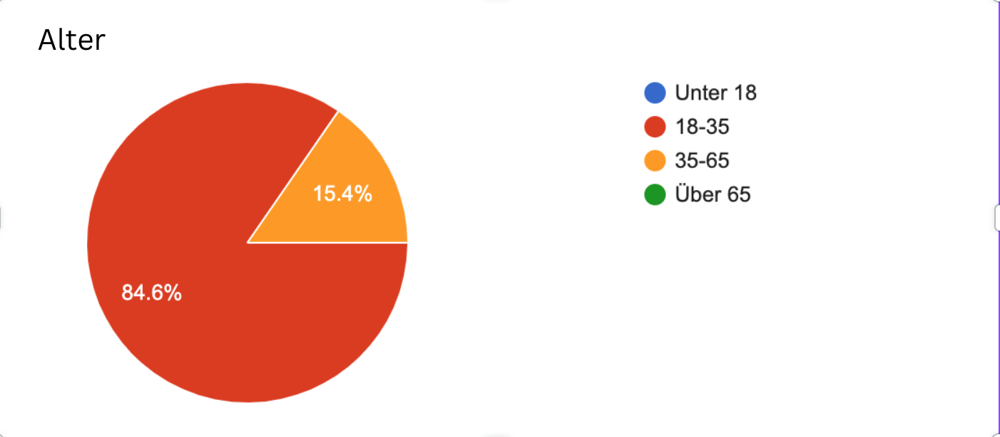
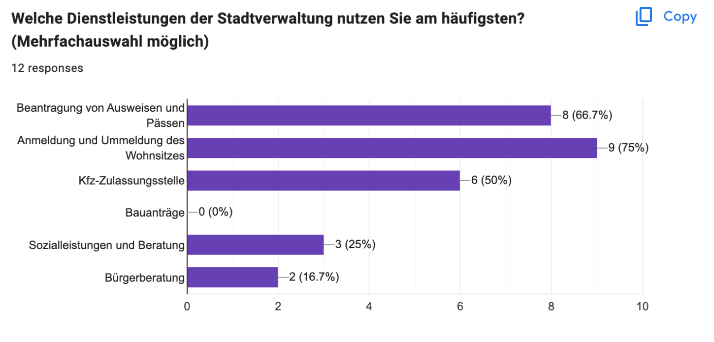
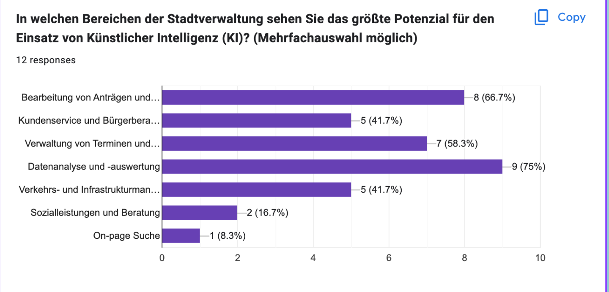
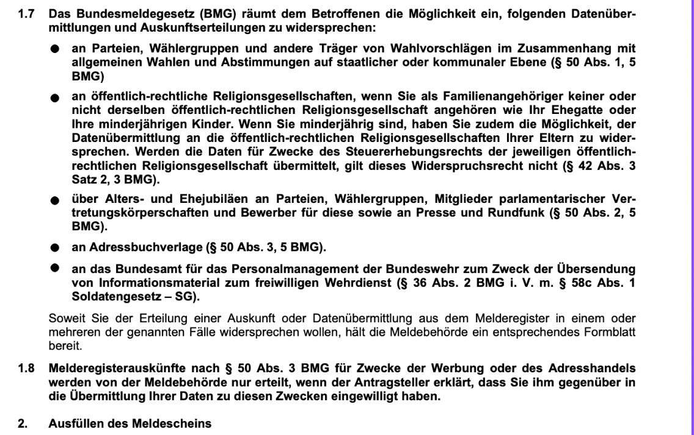

# ThinkAI
As engineers, our goal is to address real-world challenges. To achieve this, we conducted research to identify the specific problems Braunschweig residents encounter when dealing with forms. Our findings are as follows:

The people who took our survey are in these age groups

Like who can understand this?! 
this is part of the [form of house regestration. ](https://www.bus.formularservice.niedersachsen.de/cpa/cfs/eject/pdf/8.pdf?FORMUID=NI-BMG-004-DE-FL&MANDANTUID=BUS&INFODIENSTE_FORM_ID=325208789&)

And that's why we went hands on the problem

**Key Features**

* **Form Identification:** Users can describe the form they need, and the chatbot will suggest potential matches.
* **Form Guidance:** The chatbot will provide step-by-step instructions on how to fill out the form.
* **Information Retrieval:** The chatbot can access relevant information from external sources to assist users.
* **Error Handling:** The chatbot can identify and correct common errors in form completion.

**Technology Stack**

* still dk

**Data**
* Braunschweig official website

